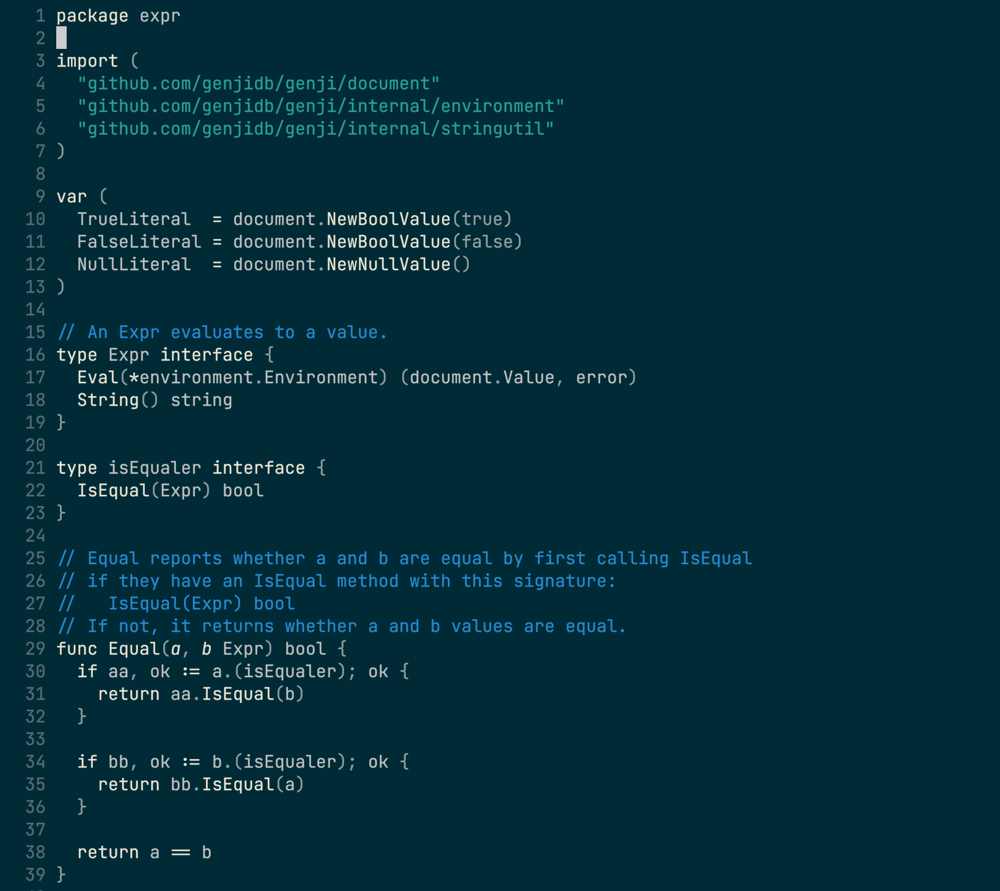
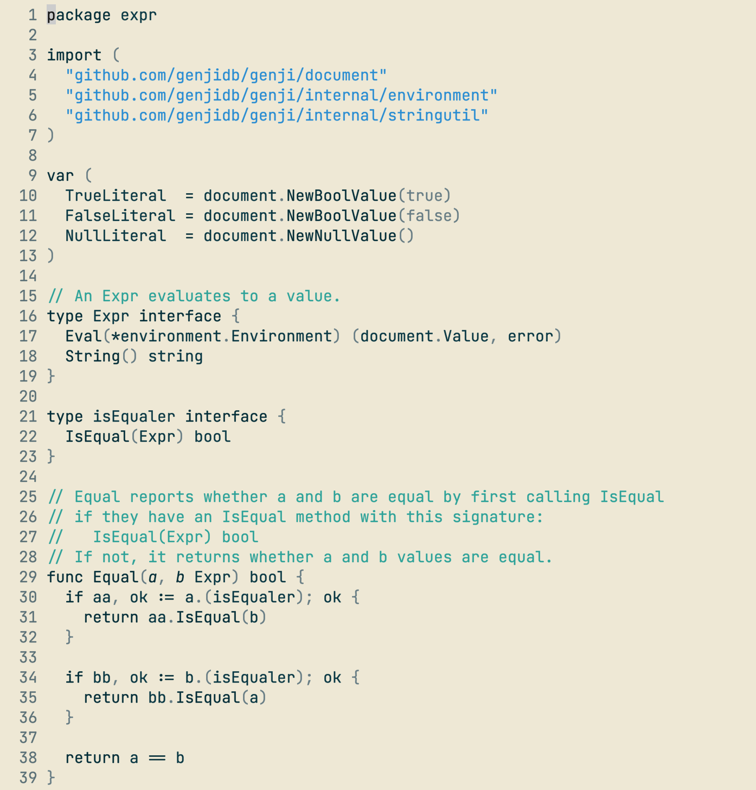
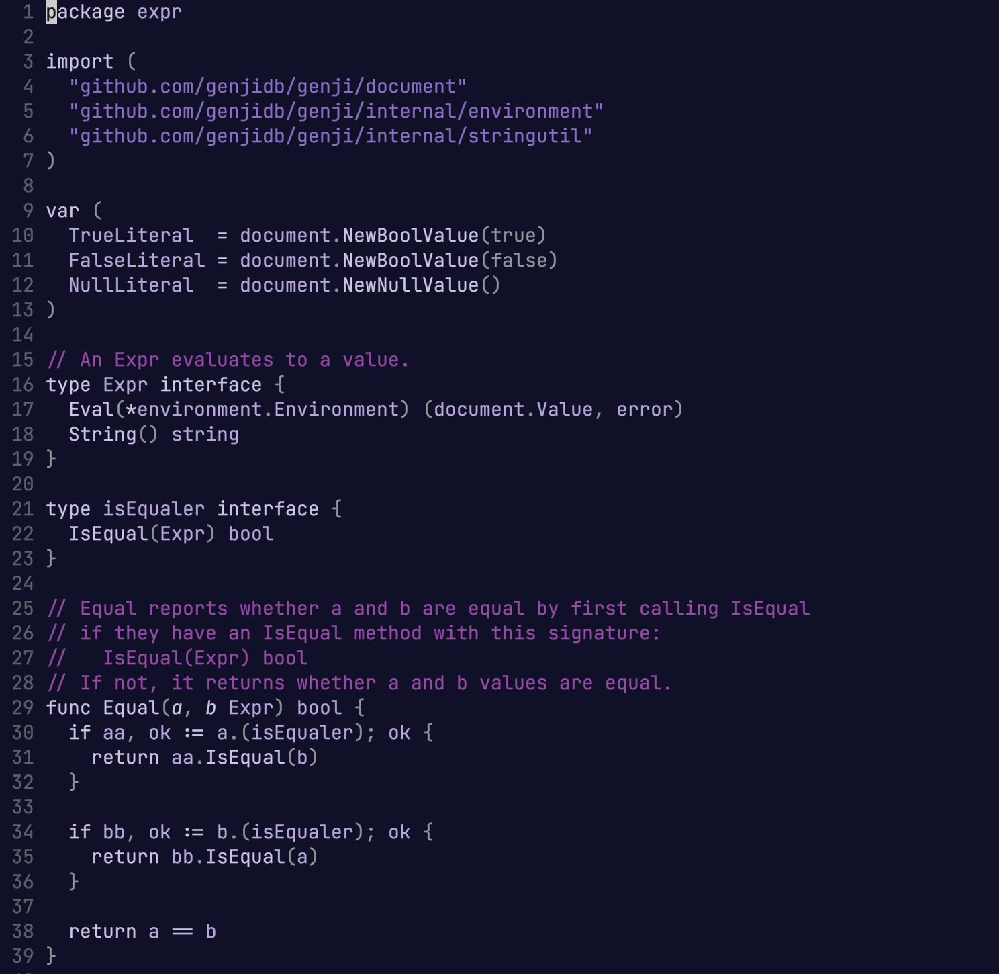
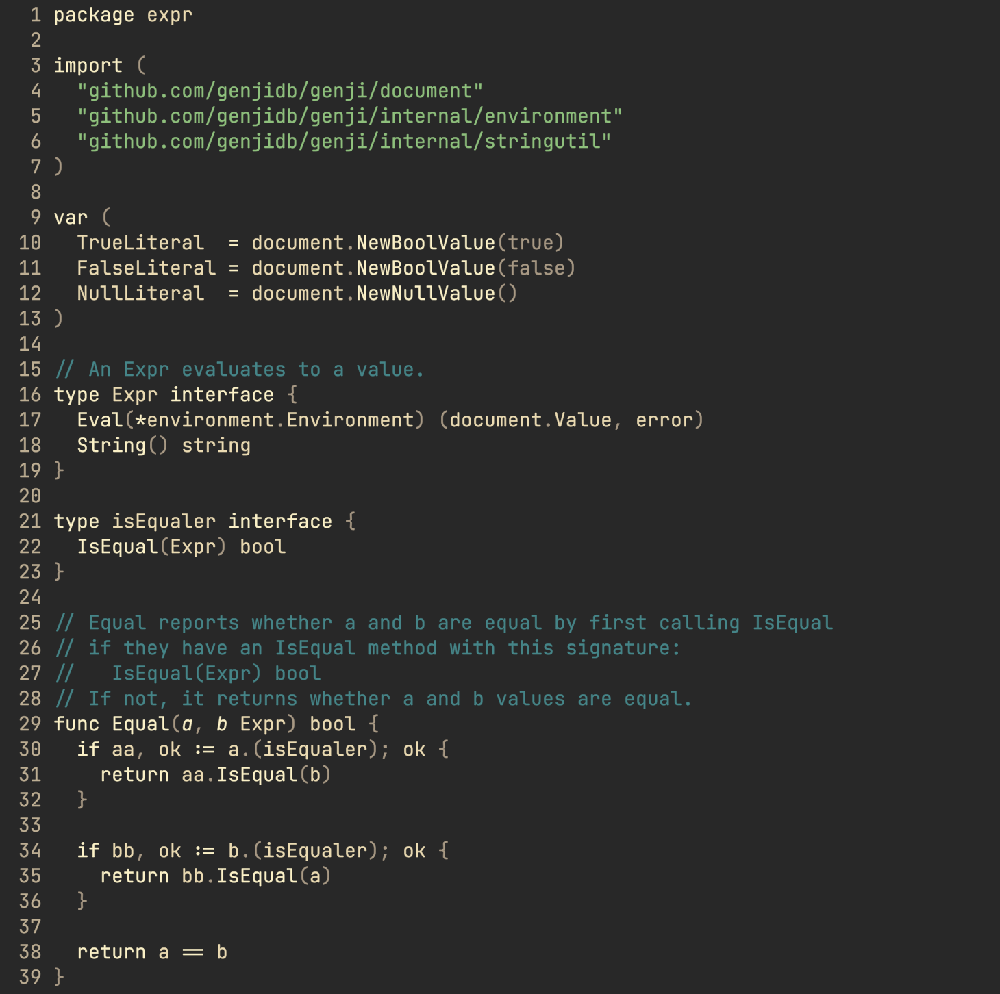
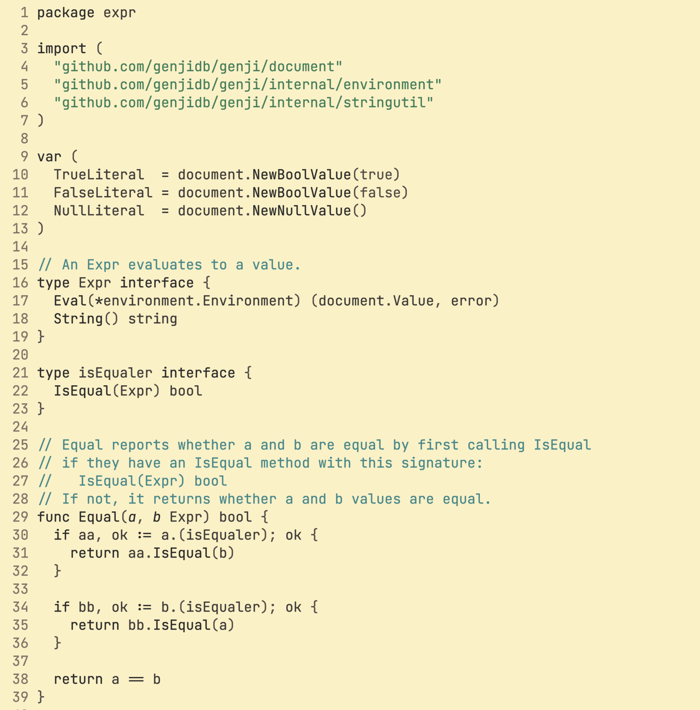

# monarized

A washed down solarized based colorscheme using [colorbuddy.nvim](https://github.com/tjdevries/colorbuddy.nvim)

monarized supports highlighting for [Treesitter](https://github.com/nvim-treesitter/nvim-treesitter), [Neovim LSP](https://neovim.io/doc/user/lsp.html), and [Telescope](https://github.com/nvim-telescope/telescope.nvim/).


## What makes this different?

Rather than going for a full spectrum of colors, which can feel like more distracting to some, `monarized` goes for four colors (`fg`, `bg`, `fade` and `hl`) and sticks with them for most of the elements. To add a bit more relief to the syntax highlighting without introducing too much contrast, each of those colors exists in their base form and a alternate one (`fg0` and `fg1`). In some cases where a only a specific color makes sense (diffs are red and green, alert is orange and error is red), those colors are used, regardless of the base colors.

The result is something standing in the middle of monochrome themes and fully colorized themes. On a personal note, when I feel stuck on something or simply bored, I find it nice to change the style to give a fresher look to the code.

### Install

You'll need (at least) Neovim 0.4.0 for `monarized` to work. You'll also need [colorbuddy](https://github.com/tjdevries/colorbuddy.nvim).

with `Vim-Plug`
``` vim
Plug 'tjdevries/colorbuddy.nvim'
Plug 'jhchabran/monarized'
```

with `packer.nvim`

``` lua
use {
  'jhchabran/monarized',
  requires = 'jdevries/colorbuddy.nvim'
  config = function()
    -- update lualine theme when changing styles
    vim.g.monarized_lualine = true
    -- update kitty background and foreground when changing styles
    vim.g.monarized_kitty_colors = true

    require('colorbuddy').colorscheme('monarized')
    -- optional: adjust style
    -- require("monarized").set_style("dark_purple")
  end
}
```

#### Styles

Styles can be changed at the runtime, with: `lua require("monarized").set_style("[STYLE NAME]")`. All styles retains the same
low contrast and washed down approach style.

#### Available styles

- `dark`: the original style, a washed down solarized dark.
- `light`: light flavor of the above.
- `purple-dark`: a purple flavor.
- `gruvbox-dark`: washed down gruvbox.
- `gruvbox-light`: light flavor of the above.

See at the bottom of this README for the screenshots.

####

If [`kitty`](https://sw.kovidgoyal.net/kitty/) is detected on the path and that `vim.g.monarized_kitty_colors` is set to true, background and terminal colors will be updated when changing styles.


#### Lualine

Monarized comes with a custom theme for [`lualine`](https://github.com/hoob3rt/lualine.nvim) that uses the same base palette, making
the style consistent, including when changing styles at the runtime.

To enable this feature, 

1. Set `g:monarized_lualine` to true.
2. Tell `lualine` to use the `monarized` theme:

```lua
  -- packer ...
  use { "hoob3rt/lualine.nvim", config = function()
    require("lualine").setup({
      options = {
        theme = require('monarized.lualine'),
        -- ...
```

#### Spell

You can use the option `g:monarized_spell` to choose how to underline the spell errors.
Possible options are `underline`, `undercurl`. By default no line is used.

### Contributing

- This is very much a work in progress 🚧
- The code structure could vastly be improved, but I am focused on making it look nice before anything else.
  - If you'd like to improve it, I'd gladly take a PR for it.
- I you have an idea of some nice colors style, feel free to open a PR!

#### Known issues

- using `telescope.nvim` and `nvim-treesitter` variable preview, `var` keyword has a wrong highlight.

## Screenshots

`dark`


`light`


`purple-dark`


`gruvbox-dark`


`gruvbox-light`

